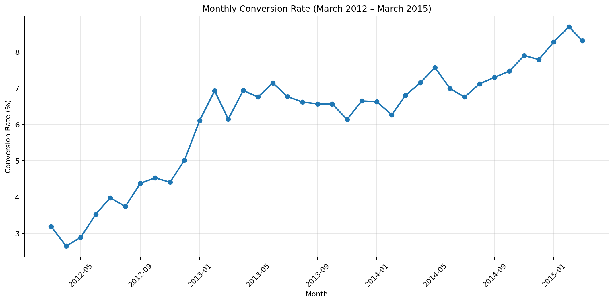
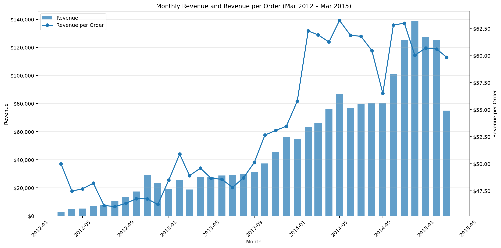
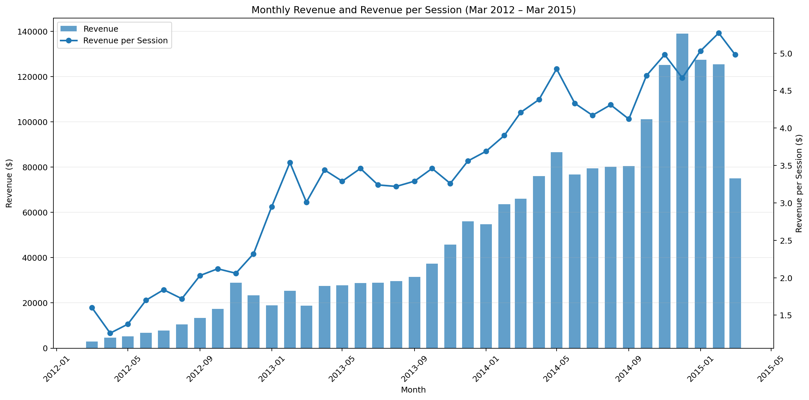

# Introduction

After completing an in-depth course on applying SQL to data analysis—a field I am deeply passionate about—I wanted to challenge myself with a realistic, multi-table e-commerce dataset to sharpen my analytical skills as an aspiring Data Analyst. To bridge theory with real-world business decision-making, I undertook an end-to-end analysis of the **Maven Fuzzy Factory** dataset using Google BigQuery.

Maven Fuzzy Factory is a growing e-commerce business specializing in custom plush toys. This project evaluates raw operational and transactional data to extract actionable business insights across website traffic performance, marketing channel efficiency, customer basket cross-selling behavior, and net product profitability—accounting for Cost of Goods Sold (COGS) and refund losses.

# Background

The Maven Fuzzy Factory database simulates a fast-growing online retail company over several years of expansion. As the company introduced new products and marketing channels, leadership needed data-driven clarity on site traffic, conversion efficiency, basket sizes, and actual profitability.

To answer these core business questions, the project utilizes five relational tables within Google BigQuery:
* `website_sessions`: Pageviews, session timing, traffic sources, and marketing campaigns.
* `orders`: Order IDs, session links, total revenue, and overall item counts.
* `order_items`: Granular item-level purchases, price per unit, and individual product COGS.
* `order_item_refunds`: Timestamped product refund records and refunded amounts in USD.
* `products`: Product catalog mapping `product_id` to `product_name`.

### Core Business Problems Solved:
1. **Traffic & Conversion Tracking:** Measuring monthly sessions, order volumes, and conversion rates across paid and organic traffic channels.
2. **Product Sales & Cross-Sell Behavior:** Tracking product adoption over time and calculating multi-product checkout likelihoods (e.g., probability of purchasing Product 2 alongside Product 1).
3. **Net Financial Performance:** Building modular SQL models to calculate true net revenue and net profit per product after deducting production costs (COGS) and customer refund losses.

# Tools I Used

* **Google BigQuery (BigQuery Sandbox):** My main workspace for the heavy lifting. I used BigQuery to write multi-step CTEs, window functions (`SUM() OVER()`), conditional aggregations (`MAX(IF(...))`), and `SAFE_DIVIDE()` to handle complex join logic and calculate exact product metrics.
* **Google Sheets:** Used for quick initial data checks and making sure my math and logic made sense before writing the full SQL queries in BigQuery.
* **SQL (BigQuery Dialect):** The core language I used to query the relational tables, clean up refund loss overlaps, and run multi-product basket analysis.
* **GitHub:** Used to host my repository, store my raw SQL scripts, organize project assets, and document the entire analytical process.

# The Analysis

### 1. Monthly Website Traffic & Conversion Rate Trends

**Business Question:** How have site traffic, order volumes, and conversion rates evolved on a monthly basis since launch?

```sql
SELECT
  EXTRACT(YEAR FROM web_session.created_at) AS year,
  EXTRACT(MONTH FROM web_session.created_at) AS month,
  COUNT(DISTINCT web_session.website_session_id) AS total_sessions,
  COUNT(DISTINCT web_orders.order_id) AS total_orders,
  ROUND(SAFE_DIVIDE(COUNT(DISTINCT web_orders.order_id), COUNT(DISTINCT web_session.website_session_id))*100, 2) AS
  conversion_rate_percent
FROM maven_fuzzy_factory.website_sessions AS web_session
LEFT JOIN maven_fuzzy_factory.orders AS web_orders
  ON web_session.website_session_id = web_orders.website_session_id
GROUP BY
  year,
  month
ORDER BY
  year,
  month
```


**Key Findings:**
* **Conversion Rate More Than Doubled:** CVR started at **3.19%** in March 2012 and steadily climbed to a peak of **8.69%** in February 2015. This steady upward trend shows that site improvements, UX tweaks, and product expansion drastically improved traffic quality and checkout efficiency over time.
* **Massive Traffic Scaling:** Monthly sessions scaled over **15x**, growing from 1,879 sessions in March 2012 to a peak of 29,722 sessions in December 2014.
* **Strong Q4 Seasonality:** The business experiences huge end-of-year holiday surges every November and December. For example, in Q4 2014, monthly order volume crossed 2,000+ orders for the first time (2,314 orders in Dec 2014 alone).

### 2. Marketing Channels That Have Been Successful

**Business Question:** Which marketing channels have been the most successful in driving overall volume, completed orders, and traffic conversion efficiency?

```sql
SELECT
  web_session.utm_source AS marketing_channel,
  COUNT(DISTINCT web_session.website_session_id) AS total_sessions,
  COUNT(DISTINCT web_order.order_id) AS total_orders,
  ROUND(SAFE_DIVIDE(COUNT(DISTINCT web_order.order_id), COUNT(DISTINCT web_session.website_session_id))*100, 2) AS
  conversion_rate
FROM maven_fuzzy_factory.website_sessions AS web_session
LEFT JOIN maven_fuzzy_factory.orders AS web_order
  On web_session.website_session_id = web_order.website_session_id
WHERE
  web_session.is_repeat_session = 0
GROUP BY
  marketing_channel
ORDER BY
  total_orders DESC;
```

| Marketing Channel | Total Sessions | Total Orders | Conversion Rate (%) |
| :--- | :--- | :--- | :--- |
| **gsearch** | 294,832 | 19,650 | 6.66% |
| **bsearch** | 57,802 | 4,061 | 7.03% |
| **Direct / Organic (`NULL`)** | 30,999 | 2,110 | 6.81% |
| **socialbook** | 10,685 | 343 | 3.21% |

**Key Findings:**
* **`gsearch` is the Dominant Volume Driver:** Google search is by far the most successful channel for scale, driving over **75% of all traffic** (294,832 sessions) and generating 19,650 orders.
* **`bsearch` Leads in Conversion Efficiency:** Bing search yields the highest conversion rate at **7.03%**, proving to be a highly qualified paid search channel despite lower total traffic volume.
* **Organic/Direct Shows Strong Brand Equity:** Direct/unattributed traffic (`NULL`) converts at **6.81%**, showing strong repeat customer intent and solid organic reach without ad spend.
* **`socialbook` Lags Behind:** Social media traffic converts at only **3.21%**—less than half the rate of search channels—indicating that social visitors are more exploratory and require improved landing page funnel targeting.

### 3. Monthly Revenue & Average Order Value (AOV) Growth

**Business Question:** How have overall monthly revenue and average revenue per order evolved as the business scaled?

```sql
WITH order_table AS (
  SELECT
    EXTRACT(YEAR FROM web_order.created_at) AS year,
    EXTRACT(MONTH FROM web_order.created_at) AS month,
    COUNT(web_order.order_id) AS total_order,
    SUM(web_order.price_usd) AS order_amount
  FROM maven_fuzzy_factory.orders AS web_order
  GROUP BY
    year,
    month
),
refund_table AS (
  SELECT
    EXTRACT(YEAR FROM refunds.created_at) AS year,
    EXTRACT(MONTH FROM refunds.created_at) AS month,
    SUM(refunds.refund_amount_usd) AS refund_amount
  FROM maven_fuzzy_factory.order_item_refunds AS refunds
  GROUP BY
    year,
    month
)

SELECT
  order_table.year,
  order_table.month,
  ROUND(order_table.order_amount - COALESCE(refund_table.refund_amount, 0), 2) AS revenue,
  ROUND(SAFE_DIVIDE(order_table.order_amount - COALESCE(refund_table.refund_amount, 0), order_table.total_order), 2) AS 
  revenue_per_order
FROM order_table
LEFT JOIN refund_table
  ON order_table.year = refund_table.year
  AND order_table.month = refund_table.month
ORDER BY
  year,
  month
```



**Key Findings:**
* **Consistent Expansion in Average Order Value (AOV):** Revenue per order steadily expanded from **$46.04** in mid-2012 to a peak of **$63.25** in May 2014, showing that cross-selling and new product releases successfully increased customer basket sizes over time.
* **Massive Top-Line Revenue Scaling:** Monthly revenue grew over **46x**, scaling from **$2,999.40** in March 2012 to a record high of **$138,914.24** in December 2014.
* **Distinct February (Month 2) Seasonal Spikes:** Looking across the yearly trends, there is a recurring revenue and AOV surge every February:
  * **Feb 2013:** AOV jumped to **$50.89** (up from $48.48 in Jan), driving revenue up to $25.3k.
  * **Feb 2014:** AOV surged to **$62.28** (up from $55.78 in Jan), pushing revenue to $63.5k.
  * *Business Context:* For an e-commerce plush toy business like Maven Fuzzy Factory, this February bump highlights strong **Valentine's Day gifting demand**, where shoppers are willing to spend more per basket on special orders.

### 4. Monthly Revenue per Session (Traffic Monetization Efficiency)

**Business Question:** How effectively has the business monetized incoming website traffic on a per-session basis over time?

```sql
WITH order_table AS (
  SELECT
    EXTRACT(YEAR FROM web_order.created_at) AS year,
    EXTRACT(MONTH FROM web_order.created_at) AS month,
    SUM(web_order.price_usd) AS order_amount
  FROM maven_fuzzy_factory.orders AS web_order
  GROUP BY
    year,
    month
),
refund_table AS (
  SELECT
    EXTRACT(YEAR FROM refunds.created_at) AS year,
    EXTRACT(MONTH FROM refunds.created_at) AS month,
    SUM(refunds.refund_amount_usd) AS refund_amount
  FROM maven_fuzzy_factory.order_item_refunds AS refunds
  GROUP BY
    year,
    month
),
session_table AS (
  SELECT
    EXTRACT(YEAR FROM sessions.created_at) AS year,
    EXTRACT(MONTH FROM sessions.created_at) AS month,
    COUNT(sessions.website_session_id) AS total_session
  FROM maven_fuzzy_factory.website_sessions AS sessions
  GROUP BY
    year,
    month
)

SELECT
  session_table.year AS year,
  session_table.month AS month,
  ROUND(COALESCE(order_table.order_amount, 0) - COALESCE(refund_table.refund_amount, 0), 2) AS revenue,
  ROUND(SAFE_DIVIDE(COALESCE(order_table.order_amount, 0) - COALESCE(refund_table.refund_amount, 0), session_table.total_session), 2) AS
  revenue_per_session
FROM session_table
LEFT JOIN order_table
  ON session_table.year = order_table.year
  AND session_table.month = order_table.month
LEFT JOIN refund_table
  ON session_table.year = refund_table.year
  AND session_table.month = refund_table.month
ORDER BY
  year,
  month
```



**Key Findings:**
* **More Than 3x Increase in Traffic Value:** Revenue generated per session expanded from **$1.26** in April 2012 to a record peak of **$5.27** in February 2015. 
* **Compounding Efficiency Gains:** The steady rise in revenue per session reflects the combined power of site conversion improvements (CVR rising from ~3% to ~8%+) and average order value expansion (AOV growing from ~$46 to ~$63).
* **Higher Paid Search Bidding Power:** As revenue per session scaled past $4.00–$5.00 in 2014–2015, the marketing team gained significant flexibility to bid higher on paid search keywords (`gsearch` / `bsearch`) while remaining highly profitable.

### 5. Product 2 Monthly Sales Volume & Seasonal Spikes

**Business Question:** How has sales volume for Product 2 (Love Bear) evolved since its launch, and are there distinct seasonal demand patterns?

```sql
SELECT
  EXTRACT(YEAR FROM order_item.created_at) AS year,
  EXTRACT(MONTH FROM order_item.created_at) AS month,
  COUNTIF(order_item.product_id = 2) AS units_of_product2
FROM maven_fuzzy_factory.order_items AS order_item
GROUP BY
  year,
  month
ORDER BY
  year,
  month
```

| Year | Month | Units Sold (Product 2) |
| :--- | :--- | :--- |
| **2012** | Mar – Dec | 0 *(Not yet launched)* |
| **2013** | Jan | 47 |
| **2013** | **Feb** | **162** 🚀 |
| **2013** | Mar – Oct | 65 – 135 |
| **2013** | Nov – Dec | 174 – 183 |
| **2014** | Jan | 183 |
| **2014** | **Feb** | **351** 🚀 |
| **2014** | Mar – Oct | 193 – 284 |
| **2014** | Nov – Dec | 377 – 387 |
| **2015** | Jan | 394 |
| **2015** | **Feb** | **644** 🚀 |
| **2015** | Mar | 223 |

**Key Findings:**
* **Massive February Demand Surge:** There is a dramatic, unmistakable spike in Product 2 sales every February across all years:
  * **Feb 2013:** Jumped **3.4x** over January (162 units vs. 47).
  * **Feb 2014:** Nearly doubled January volume, reaching **351 units**.
  * **Feb 2015:** Hit an all-time peak of **644 units** (a 63% jump over Jan).
* **Valentine's Day Product Fit:** As expected for a product like the Love Bear plush toy, February is the primary revenue driver for Product 2, making early inventory prep in December/January critical.
* **Expanding Year-over-Year Baseline:** Beyond the February spikes, baseline monthly sales expanded steadily from ~80 units/month in mid-2013 to ~250 units/month in mid-2014, showing strong underlying product-market fit.
# Conclusion
